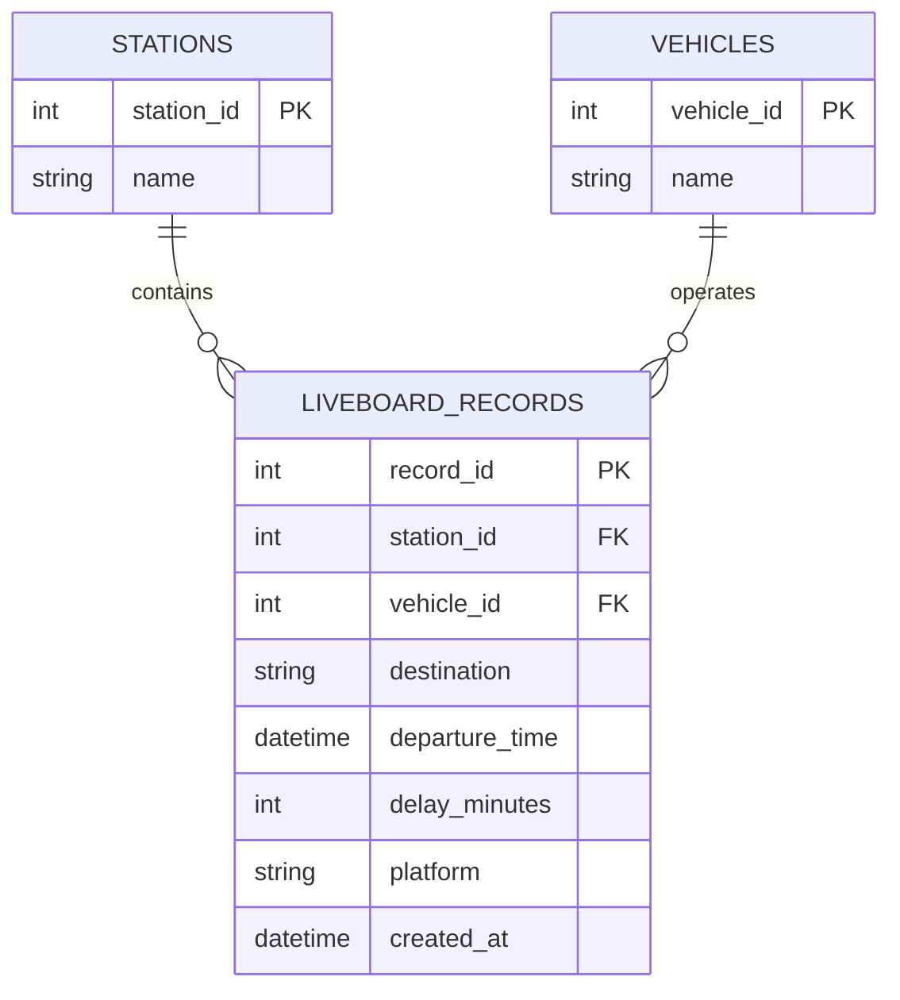

# 🚉 RailPulse: Azure Serverless Liveboard Ingestion Pipeline


## Project Overview

RailPulse is a cloud-native data engineering project designed to collect, process and store real-time railway operational data from the Belgian SNCB/NMBS network.

This project represents the second stage of the RailwayPulse platform, where the local SQL infrastructure developed previously is migrated to Microsoft Azure. A serverless ingestion pipeline continuously retrieves live departure information from the SNCB/iRail API and stores it in an Azure SQL Database for future analytics and Business Intelligence.

The solution was built using Azure Functions running on a Consumption Plan, ensuring automatic scaling while remaining within the Azure for Students free tier.

### Azure Resource Group

The project resources are deployed inside a dedicated Azure Resource Group.


### Azure Function App

The serverless ingestion pipeline is hosted in an Azure Function App running on the Consumption Plan.


### Azure SQL Database

The project stores historical railway data in an Azure SQL Database running in Serverless mode.


---

# Objectives

The project focuses on building a secure and automated cloud ETL pipeline capable of:

* retrieving real-time liveboard information from the SNCB/iRail API;
* transforming API responses into a normalized relational model;
* storing historical railway data inside Azure SQL;
* preventing duplicate records during scheduled executions;
* preparing the database for future Power BI dashboards and AI-powered querying.

---

# Architecture

```
                 SNCB / iRail Live API
                          │
                          ▼
              Azure Function (HTTP Trigger)
                          │
                          │
              Azure Function (Timer Trigger)
                          │
                          ▼
                Data Transformation Layer
                          │
                          ▼
                  Azure SQL Database
                          │
                          ▼
              Historical Liveboard Records
                          │
                          ▼
            Power BI & AI Assistant (Next Sprints)
```

---

# Technologies

| Category       | Technologies                                       |
| -------------- | -------------------------------------------------- |
| Language       | Python 3.10                                        |
| Cloud Platform | Microsoft Azure                                    |
| Compute        | Azure Functions                                    |
| Database       | Azure SQL Database (Serverless)                    |
| Connectivity   | pyodbc                                             |
| Data Source    | SNCB / iRail Liveboard API                         |
| Security       | Azure Application Settings (Environment Variables) |

---

# Azure Infrastructure

The entire project is deployed inside a dedicated Azure Resource Group.

Infrastructure components include:

* Azure Function App
* Azure SQL Server
* Azure SQL Database
* Application Insights
* Log Analytics Workspace
* Azure Storage (automatically provisioned for the Function App)

The database runs in **Serverless** mode with **automatic pause** enabled to minimize cloud costs.

The Function App uses the **Consumption Plan**, allowing executions only when requests or scheduled triggers occur.


---

# ETL Pipeline

## Extract

The Azure Function sends HTTP requests to the SNCB/iRail Liveboard API.

Live departure information is collected for several major Belgian railway stations.

The retrieved JSON includes information such as:

* station
* train identifier
* destination
* departure time
* delay
* platform

---

## Transform

Before insertion, the function:

* validates API responses;
* extracts only the required attributes;
* normalizes entities;
* separates stations, vehicles and liveboard records;
* converts timestamps into SQL-compatible DATETIME values.

---

## Load

The transformed data is inserted into Azure SQL using parameterized SQL statements executed through pyodbc.

The relational model separates operational entities into dedicated tables to avoid redundancy and improve query performance.

The following screenshot shows historical liveboard records successfully stored in Azure SQL.


---

# Database Schema

The database follows a normalized relational design.

The Azure SQL database contains three normalized tables.


## Entity Relationship Diagram



Main tables:

### stations

Stores railway station metadata.

| Column       | Description  |
| ------------ | ------------ |
| station_id   | Primary Key  |
| name         | Station name |

---

### vehicles

Stores train identifiers.

| Column       | Description      |
| ------------ | ---------------- |
| vehicle_id   | Primary Key      |
| name         | Train identifier |

---

### liveboard_records

Stores historical departure observations.

Each record references:

* a station
* a vehicle
* a departure timestamp

along with operational information such as:

* destination
* delay_minutes
* platform

Foreign keys guarantee referential integrity between all tables.

---

# Idempotency Strategy

Because the Timer Trigger executes periodically, duplicate records could otherwise be inserted multiple times.

To guarantee idempotent executions, a UNIQUE constraint is applied on:

```
(station_id, vehicle_id, departure_time)
```

Combined with the insertion logic, this ensures that repeated executions never create duplicate historical records.

The ingestion pipeline can therefore run safely every 15–30 minutes while preserving data integrity.

---

# Automation

The project includes two Azure Function triggers.

The Function App exposes both an HTTP Trigger for manual execution and a Timer Trigger for automated scheduled ingestion.


## HTTP Trigger

Used for:

* manual execution;
* testing;
* debugging;
* immediate data ingestion.

---

## Timer Trigger

Runs automatically according to a CRON schedule.

This enables continuous historical data collection without any manual intervention.

---

# Security

Sensitive credentials are never stored in source code.

Database connection strings are securely managed using Azure Application Settings and accessed through environment variables.

The following Application Settings are configured in Azure. Sensitive values are hidden.


This approach follows cloud security best practices while keeping the repository safe for publication.

### Required Application Settings

| Variable | Description |
|-----------|-------------|
| DB_SERVER | Azure SQL Server hostname |
| DB_DATABASE | Database name |
| DB_USERNAME | SQL login |
| DB_PASSWORD | SQL password |

---

# Monitoring

Application Insights is used to monitor Azure Function executions and request activity over time.

The following chart illustrates successful request activity captured by Application Insights.


---

# Cost Optimization

The project was intentionally designed to remain within the Azure for Students free tier.

Implemented optimizations include:

* Azure SQL Serverless
* automatic database pause
* Consumption Plan Functions
* lightweight relational schema
* serverless execution
* no permanently running virtual machines

---

# Project Structure

```
railpulse-challenge-azure/
├── docs/
│   └── images/
├── function_app.py
├── schema.sql
├── host.json
├── requirements.txt
├── .gitignore
└── README.md
```

Sensitive files such as local.settings.json and environment files are excluded through .gitignore.

---

# Deployment Guide

The project can be deployed in a few steps.

1. Create an Azure SQL Server.
2. Create an Azure SQL Database using the Serverless tier.
3. Execute `schema.sql`.
4. Create an Azure Function App (Python 3.10, Consumption Plan).
5. Configure the required Application Settings.
6. Publish the Function App using Azure Functions Core Tools.
7. Test the HTTP Trigger.
8. Enable the Timer Trigger for automated ingestion.

---

# Troubleshooting

## Azure SQL connection issues

- Verify firewall rules.
- Check Application Settings.
- Ensure the SQL Server is running.

## Function not triggering

- Check Timer Trigger CRON expression.
- Review Application Insights logs.

## Duplicate records

- Verify the UNIQUE constraint:
(station_id, vehicle_id, departure_time)

## Serverless database delay

- Azure SQL Serverless may require a few seconds to resume after automatic pause.

---

# Installation

Clone the repository.

```
git clone https://github.com/happiness910/railpulse-challenge-azure.git
```

Create a virtual environment.

```
python -m venv .venv
```

Install dependencies.

```
pip install -r requirements.txt
```

Configure the required Azure Application Settings or local environment variables.

Deploy the Function App using Azure Functions Core Tools or directly through the Azure Portal.

For Azure deployment, configure the required Application Settings before publishing the Function App.

---

# Future Improvements

Several enhancements could extend this project into a production-grade transit platform.

* Ingest additional Belgian railway hubs.
* Store arrival information alongside departures.
* Add retry mechanisms for temporary API failures.
* Introduce logging and monitoring dashboards.
* Integrate Power BI for operational analytics.
* Connect the database to a conversational AI assistant capable of translating natural language into SQL queries.

---

# RailwayPulse Project Roadmap

This repository corresponds to **Sprint 2** of the RailwayPulse platform.

### Sprint 1

Relational modelling using GTFS Static data and SQLite.

### Sprint 2 (this repository)

Migration to Azure SQL and implementation of a serverless ingestion pipeline.

### Sprint 3

Power BI dashboards connected directly to the Azure SQL database.

### Sprint 4

Natural language analytics using an open-source Large Language Model capable of generating SQL queries from user questions.

---

# Author

Developed as part of the BeCode Data & AI training program.

The project demonstrates practical skills in:

* Cloud Data Engineering
* Azure Functions
* Azure SQL
* ETL Pipelines
* Relational Database Design
* Serverless Computing
* Python
* SQL

---
# ⏱️ Timeline

This project was completed in **2 days**.

---

# 📌 Personal Situation
This project was done as part of the AI & Data Science Bootcamp at BeCode.

[LinkedIn - Iness Khatiri](https://www.linkedin.com/in/iness-khatiri-14392a258)
